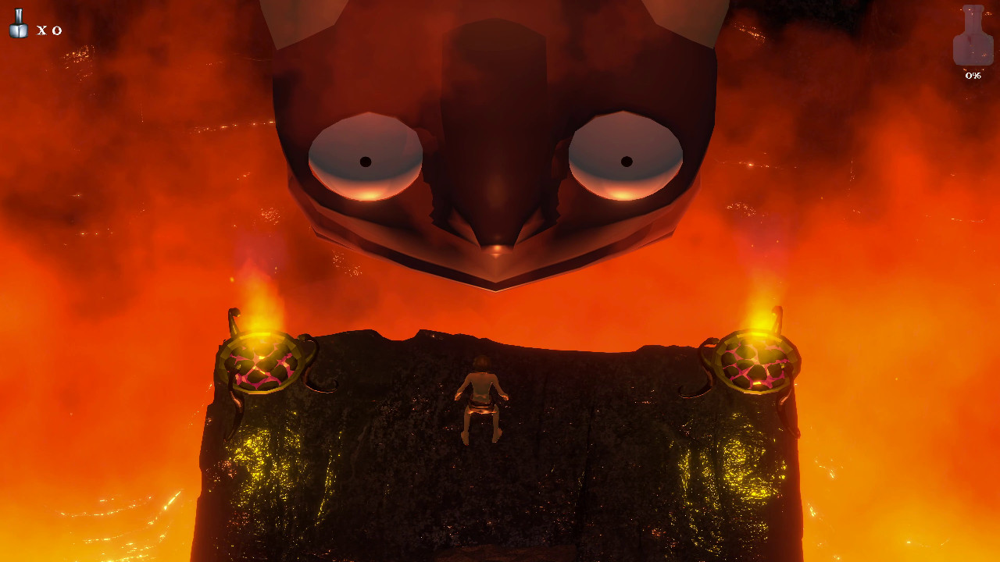

# About this Repo / Status
This project includes a fully playable first level and the beginnings of a rough second one.  
Development is currently on hold while I focus on my new game project, *Knight Drift*.  

This repo reflects my ongoing journey of experimenting, learning, and enjoying the creative process in this space.  

Try the game here: [releases](https://github.com/bensiroshton/masaya/releases/tag/release).

### What is it?

# Masaya
Masaya is a twin stick shooter adventure where you play loosely as a fisherman who is shipwrecked on a mysterious island.  
There, he encounters a demon who offers to aid him; who is he and why is he helping?

## Working Title
The name comes from the Masaya Volcano in Nicaragua, long believed to be a gateway to hell.  
It foreshadows the depths that our hero’s journey will ultimately reach.

## Gameplay
Use a twin stick controller to move with the left stick and aim/fire with the right.  
Shoot everything, avoid getting hit, and collect **Cards** and **Mana** to power up your player.  

Each time you die, you lose half your Mana, reaching checkpoints reduces how far you’ll need to travel to try again.

## Cards
Throughout the world you’ll find **Cards** that enhance your abilities.  
Open the card menu with the Start/Option button to manage them:

- **Equip** a card by placing a gem on it.
- **To level up:** first **collect duplicates of the same card**, then **spend Mana** to apply the upgrade.

## Controls
A game controller is required (tested with Xbox 360, Xbox One, PS5, and Switch Pro controllers).

| Input            | Action                    |
|------------------|---------------------------|
| **Left Stick**   | Move                      |
| **Right Stick**  | Aim / Fire                |
| **Start/Option** | Card Management           |
| **Alt+F4**       | Quit (no system menu yet) |
| **Alt+Enter**    | Toggle Fullscreen         |

# Custom Editor Tools
There are a number of Editor tools that have been developed for this project.  Two worth calling out here:

## Prefab Painter
This let's you paint prefabs onto the surface of other meshes.  Unlike [Polybrush](https://docs.unity3d.com/Packages/com.unity.polybrush@1.2/manual/index.html) this does not touch the underlying mesh or create references to other meshes; however it uses an **internal** Unity method `IntersectRayMesh` so be aware that your version of Unity might not support this.

## Game Palette
A simple palette system to ensure all textures, materials, and colors stay in harmony throughout the game.  

This is an artist driven palette system that I use to keep the palette cohesive throughout the game.  It is not a magic bullet as it requires you to manually make use of it when you add new textures, materials, choosing particle colors, etc..  
In a nutshell this let's you create a palette based on three colors, a red, a yellow and a blue and any number of variations with saturation shifts.  Once you have your palettes you can drag an image onto the palette and it will be remapped to use that palette (requires **ImageMagick** to be on your **PATH**).  I then use these remapped textures for all my meshes and for materials and other color based properties I use the color picker to choose from my palette.  By doing so you are guaranteed all your colors will be in harmony.

Note, there are some bugs in this version that have been fixed in my latest version for *Knight Drift* however they have not been back ported here.

# Community
I encourage you to fork this project and make your own changes or improvements.  
If you build on it, I’d love to see what you create - share a video with me and I might feature it here!  
Feel free to ask any questions and I'll do what I can to answer.

## Getting Started
Load the scene Levels/GameScene then **additively** load the area you want to work on (ie., Levels/Floor-01), make the area the **active scene**.  

Most code found in [Packages/com.siroshton.masaya/](Packages/com.siroshton.masaya/).

# Development Tools
The following tools were used during the creation of this game.

- Unity
- Visual Studio (Community Edition)
- Blender
- Audacity
- Affinity Photo

# License  
- **Code**: [MIT License](LICENSE) — free to use in commercial and non-commercial projects (with attribution).  
- **Assets**: [CC BY-NC 4.0](ASSETS_LICENSE.md) — free to remix, redistribute, or re-release for non-commercial use only, with attribution.  

Note: Certain third-party assets included in this repository are licensed separately under their original terms.  
See the [Third-Party Assets README](Assets/ThirdParty/README.md) for details.  
